# Getting Started
Getting started with the OTEL demo including running the OpenSearch Server and Dashboard.
This Getting started tutorial will help you install a live OpenTelemetry Demo on top of an AWS EC2 instance.

### Additional Resources
 - [DemoLandingPage.md](DemoLandingPage.md)
 - [GettingStarted.md](GettingStarted.md)
- [Observability Introduction.md](Observability-Introduction)

## Intro
The OpenTelemetry Demo is a microservice distributed system intended to illustrate the implementation of OpenTelemetry in a near real-world environment.
It provides a realistic example of a distributed system that can be used to demonstrate OpenTelemetry instrumentation and observability.

> OpenTelemetry Demo is composed of microservices written in different programming languages that talk to each other over gRPC and HTTP


https://opentelemetry.io/docs/demo/architecture/

---
We use the above sample demo environment and solve simple questions that can be asked by an OS Observability Assistant user. Some initial questions we are working can be seen below:

1. What is the current response time of the product catalog service?
2. How many requests are being processed by the payment service per second?
3. What is the average latency of the shopping cart service?
4. Are there any errors being reported by the payment service?
5. How many requests have been processed by the shopping cart service in the last hour?

By analyzing the User interaction flow we can address these question among many others and investigate anomalies in the system


---
## Installation Using AWS
This specific tutorial will help users to install the OpenSearch OpenTelemetry Demo on an EC2 instance and start experimenting with OpenSearch's Observability solutions.

### Prerequisites
- AWS account
- GitHub Access
- Some basic knowledge of Git & Docker

### Step 1

_Setup an AWS account:_

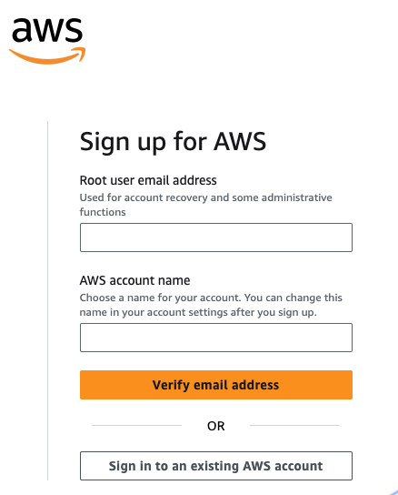

Login in to your AWS account using the root user & Navigate to EC2 instance

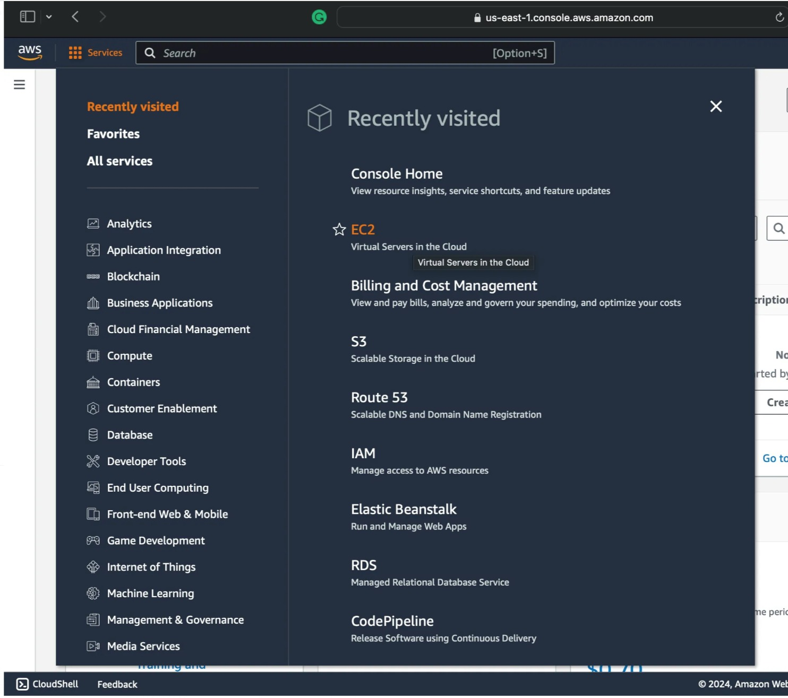

Create a security group for the OTEL-Demo instance
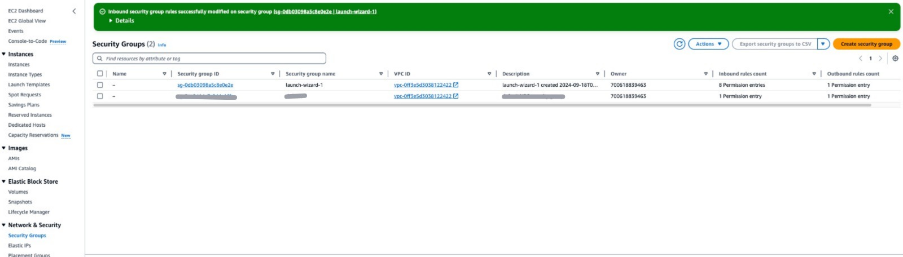

Add inbound rules so that the different demo services will be accessible from the outside (not protected)
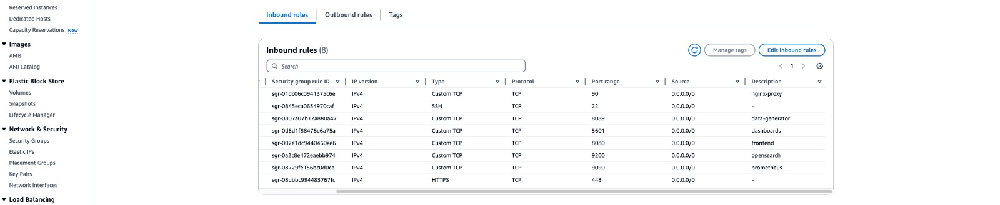

### Ports We Open:
 - OpenSearch Dashboards 5601
 - OpenSearch Node 9200
 - FrontEnd web 8080
 - FrontEnd Nginx Proxy 90
 - Prometheus DB 9090
 - locust Data Loader 8089


Create the key-pair that we will use to access the server from the terminal
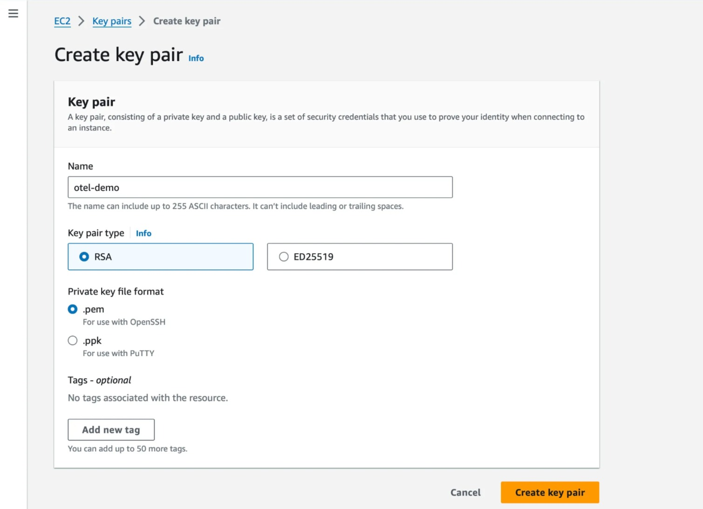

Initialize an AMI/Ubuntu instance using the security group and key pair that we created earlier, the memory (RAM) must not be less than 16 GB so T2 x large is recommended.
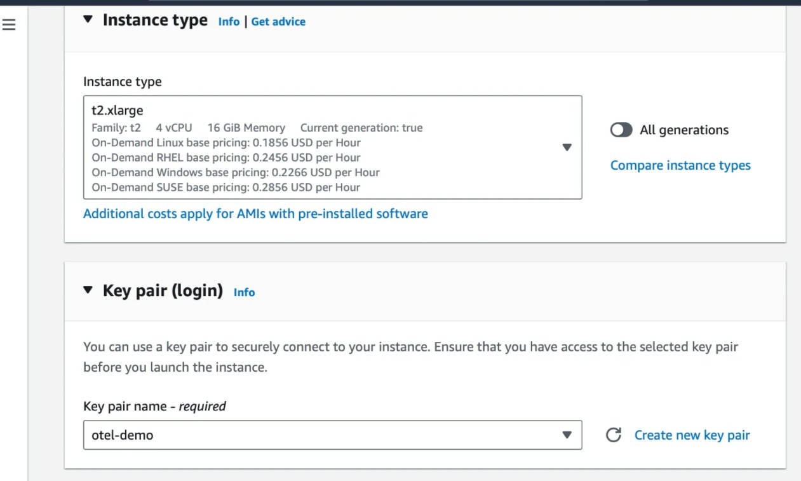
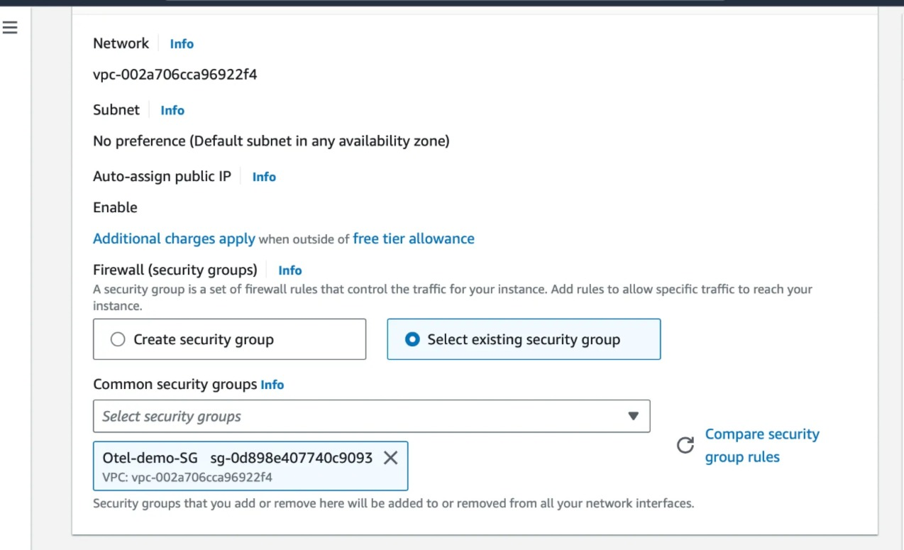

Wait until instance is ready and connect to the terminal using the key-pair previously created
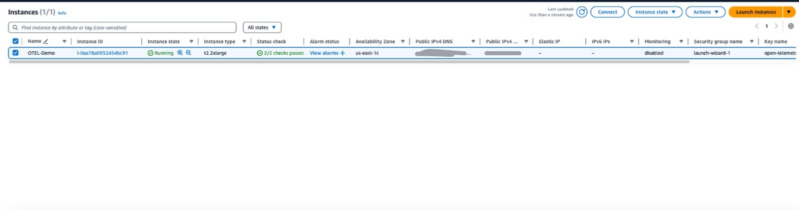

Connect into the Instance's terminal
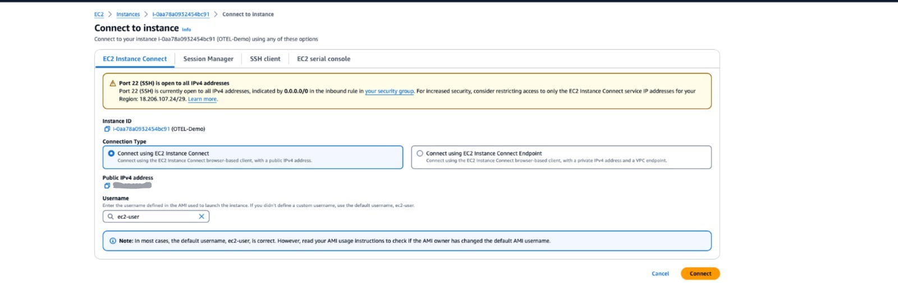

### Terminal Setup
Once in terminal - install the following:

### Docker
 ```bash
sudo yum update -y
sudo yum install docker -y
sudo service docker start
sudo usermod -a -G docker ec2-user
 ```
Validate docker was installed correctly:
```bash
docker --version
sudo docker run hello-world`
```
Now install `docker-compose`
```bash
sudo curl -L "https://github.com/docker/compose/releases/latest/download/docker-compose-$(uname -s)-$(uname -m)" -o /usr/local/bin/docker-compose
sudo chmod +x /usr/local/bin/docker-compose
```
Validate docker-compose was installed correctly:
```bash
docker-compose --version
```

### OpenSearch OpenTelemetry-Demo
Install `git` package
```bash
sudo yum install git -y
```
now clone the opensearch open-telemetry demo project:
```bash
git clone https://github.com/opensearch-project/opentelemetry-demo.git
```
 
### Running the Demo
Go into the downloaded repo
```bash
cd opentelemetry-demo/
```
update the memory areas `vm.max_map_count` to support OpenSearch engine vm requirements
```bash
sudo sysctl -w vm.max_map_count=262144
```

Now run the docker-compose command:
```bash
docker-compose up -d
```
Once the docker images are being downloaded and complete the build process and running,
The terminal should look as follows:

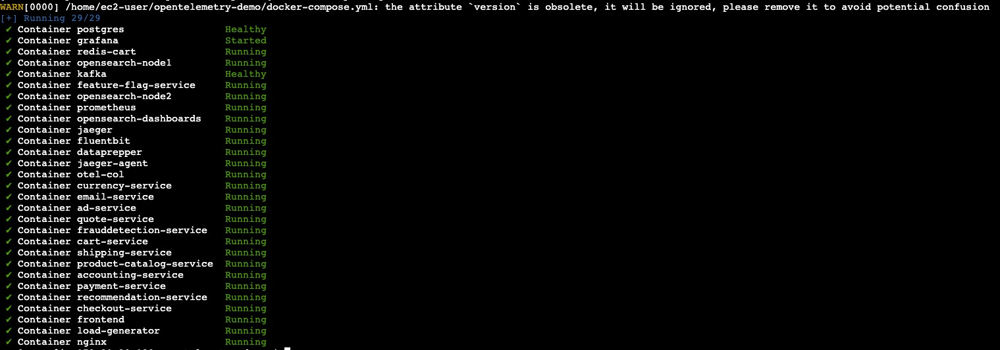

---

Once All The services are running we can access the EC2's public domain name with the Security group's open ports.

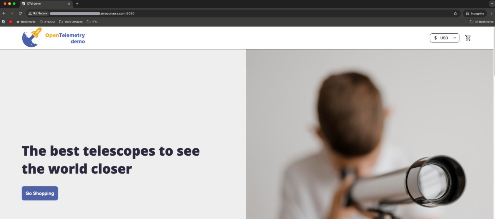

For This step please use the [Getting Started](GettingStarted.md) tutorial that contains login and operation instructions for using OpenSearch Observability
User Experience. 